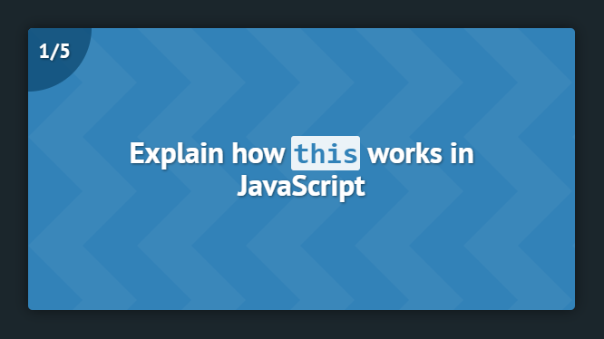

## Interview Flashcards App

An app that allows you to write (or borrow) practice interview questions and answers in **markdown**, and then test yourself with the mobile app on-the-go!

**Mobile App Demo: [https://interview-flashcards.netlify.com/](https://interview-flashcards.netlify.com/)**

### Why this one?
There are _plenty_ of flashcard apps out there to help developers with interview prep. However, I noticed a few things about most of them that I wasn't thrilled about:

* Requires an account 
* Must use their WYSIWYG to submit custom questions and answers
* No code syntax highlighting
* Not built for mobile use
* Advertisements and/or paid plans
* Overly complex

I longed for an app where I could simply write my questions and answers in **markdown files** and then use a **simple mobile app** to practice with. Besides, most collections of open source interview questions out there exist as markdown files (i.e. [https://github.com/yangshun/front-end-interview-handbook](https://github.com/yangshun/front-end-interview-handbook)). Borrow or write the interview questions that are relevant to you!

### How to Use

1. Clone or fork the repo
2. `cd interview-flashcards && npm start` (bootstrapped with create-react-app) 
3. Add any questions and answers to the `public/question_answer_pairs` directory
4. Push to github and then publish to a hosting platform of your choice ([Netlify](https://www.netlify.com/) perhaps), or just run locally and hit your computers IP on port 3000 on your mobile device

## Available Scripts

This project was bootstrapped with [Create React App](https://github.com/facebook/create-react-app).

In the project directory, you can run:

### `npm start`

Runs the app in the development mode. 
Open [http://localhost:3000](http://localhost:3000) to view it in the browser.

The page will reload if you make edits. 
You will also see any lint errors in the console.

### `npm run add (num: optional)`

Writes additional qa_pair directories to the `/question_answer_pairs` directory.

### `npm run setup`

Reads the `/question_answer_pairs` directory and updates the mobile app. Run this when you delete any qa_pair directories.

### Supported Versions:

* Node: v11.15.0
* NPM: v6.7.0